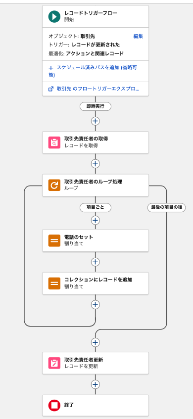
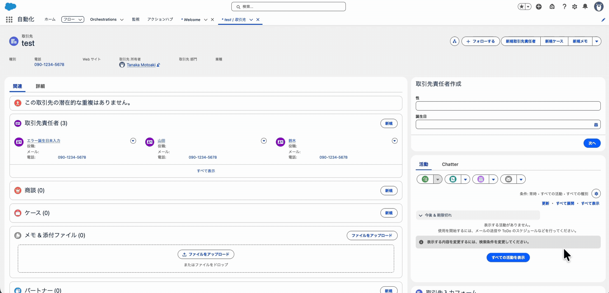

# Salesforce 自動テストについての考え方まとめ


---


# 現状

Copadoの「State of Salesforce Testing」レポートによると、**84%のSalesforceチームが手動テスト方法を他のテストアプローチと併用して使用し続けています**。この組み合わせがリリーススケジュールの遅延と一貫性のない結果を生み出しています。 [Qalified](https://qalified.com/blog/test-salesforce-low-code/)

つまり、**ほとんどのチームは自動テストを「ちゃんと」やっていません**。

テストに関する事例も専用テストツールの導入結果やマーケティングに関する記事・情報が多いため、全体的にSalesforceのアプリケーションに対する全体的なテスト戦略について事例の情報はないと言って良さそうです。

よって、各現場におけるテストや品質担保に関するレベルや合意形成を現場ごとに行っていく・探っていく必要性がある、というのが結論大方針になるかと思います。


# アジャイルテスティングの適応

そのままの形で適用できるわけではないと思いますが、アジャイル開発の中で自動テストを継続的に運用していくための考え方と、その考え方にSalesforceでのテストを適合していく場合どうなるかの整理をしてみます。

## テストピラミッドとSalesforceへの適用

### 古典的なテストピラミッドの基本概念

Mike CohnとMartin Fowlerが提唱したテストピラミッドは、自動テストの構造を視覚的に表現したモデルです。 [martinfowler](https://martinfowler.com/articles/practical-test-pyramid.html)[Martin Fowler](https://martinfowler.com/bliki/TestPyramid.html)底辺から頂点に向かって、**ユニットテスト（最多）→ 統合テスト（中程度）→ E2Eテスト（最少）**という階層構造を取ります。この構造は「高レベルになるほどテスト数を減らすべき」という原則に基づいています。 [martinfowler](https://martinfowler.com/articles/practical-test-pyramid.html)[Qase](https://qase.io/blog/test-pyramid/)

GoogleはTest Sizesという実用的な分類を採用しており、テストを**Small/Medium/Large**に区分します。Smallテストはネットワークやデータベースへのアクセスを禁止し、60秒以内の実行を求めます。Mediumテストはlocalhost接続とデータベースアクセスを許可し、300秒以内に完了する必要があります。 [Mike Bland](https://mike-bland.com/2011/11/01/small-medium-large.html)Largeテストは外部システムとの通信を含む完全なシステムテストで、900秒以上の実行時間が許容されます。 [googleblog](https://testing.googleblog.com/2010/12/test-sizes.html)

### Salesforce環境へのマッピング

|テストサイズ|Salesforce実装|推奨比率|
|---|---|---|
|Small（単体）|Jestによるモック付きLWCテスト、純粋なApexロジックテスト|70-80%|
|Medium（統合）|DML/SOQLを含むApexテスト、@wireモック付きLWCテスト|15-20%|
|Large（E2E）|UTAM、Selenium、PlaywrightによるUIテスト|5-10%|

Salesforce固有の分類として、**Apexテスト**はサーバーサイドのビジネスロジックを検証し、**LWC Jestテスト**はフロントエンドコンポーネントをローカルで高速にテストします。**UIテスト**はUTAMやPlaywrightを使用して実際のユーザーフローを検証します。

## 踏まえたまとめ

Salesforceでの自動テスト成功には、**テストピラミッドの原則に従った階層的なアプローチ**が不可欠です。

現状の運用を推察すると、
1. サーバーサイドのロジックやフローのふるまいに対する検証でApexによるテストで対応できるケースは可能な限りApexによるテストコードによるテストを行う。
2. 画面フローなどフロントエンドに関連する部分のテストはLWCを利用していない場合独立したテストを実行できないため、統合テストでコンポーネント間の連携と併せて、E2Eテスト(PlaywrightやProvar)で重要なユーザーフローに限定したテストを行う。


# Apexテストの具体例

※多様なテストの書き方がありうるので、シンプルな例を示します。


## 前提

以下のトリガー保存後フローを考えます。

- 取引先の電話番号を変更した場合、そこに所属する取引先責任者の電話番号も同じものに更新する。

### フロー



### 機能の動作イメージ




## Apexテストコード例

```apex
@isTest
private class AccountContactPhoneSyncTest {
    
    /**
     * Account更新時に関連するContactの電話番号がAccountの電話番号に同期されることを確認
     */
    @isTest
    static void testAccountPhoneUpdate_SyncsToContacts() {
        // テストデータ作成
        Account testAccount = new Account(
            Name = 'Test Account',
            Phone = '03-1111-2222'
        );
        insert testAccount;
        
        // 関連するContactを作成
        List<Contact> contacts = new List<Contact>();
        contacts.add(new Contact(
            FirstName = 'Test',
            LastName = 'Contact1',
            AccountId = testAccount.Id,
            Phone = '090-1111-1111'
        ));
        contacts.add(new Contact(
            FirstName = 'Test',
            LastName = 'Contact2',
            AccountId = testAccount.Id,
            Phone = '090-2222-2222'
        ));
        insert contacts;
        
        // Accountの電話番号を更新
        String newPhone = '03-9999-8888';
        testAccount.Phone = newPhone;
        
        Test.startTest();
        update testAccount;
        Test.stopTest();
        
        // 関連するContactの電話番号が同期されていることを確認
        List<Contact> updatedContacts = [
            SELECT Id, Phone 
            FROM Contact 
            WHERE AccountId = :testAccount.Id
        ];
        
        System.assertEquals(2, updatedContacts.size(), '2件のContactが存在するべき');
        for (Contact c : updatedContacts) {
            System.assertEquals(newPhone, c.Phone, 
                'ContactのPhoneがAccountのPhoneに同期されるべき');
        }
    }
    
    /**
     * Accountに関連するContactがない場合でもエラーが発生しないことを確認
     */
    @isTest
    static void testAccountPhoneUpdate_NoContacts_NoError() {
        // ContactなしのAccountを作成
        Account testAccount = new Account(
            Name = 'Test Account No Contacts',
            Phone = '03-1111-2222'
        );
        insert testAccount;
        
        // Accountの電話番号を更新
        testAccount.Phone = '03-9999-8888';
        
        Test.startTest();
        // エラーが発生しないことを確認
        try {
            update testAccount;
            System.assert(true, 'Contactがなくてもエラーは発生しないべき');
        } catch (Exception e) {
            System.assert(false, '予期しないエラーが発生: ' + e.getMessage());
        }
        Test.stopTest();
    }
    
    /**
     * 複数のAccountを一括更新した場合も正しく同期されることを確認
     */
    @isTest
    static void testBulkAccountPhoneUpdate_SyncsToContacts() {
        // 複数のAccountを作成
        List<Account> accounts = new List<Account>();
        for (Integer i = 0; i < 5; i++) {
            accounts.add(new Account(
                Name = 'Test Account ' + i,
                Phone = '03-0000-000' + i
            ));
        }
        insert accounts;
        
        // 各Accountに関連するContactを作成
        List<Contact> contacts = new List<Contact>();
        for (Account acc : accounts) {
            contacts.add(new Contact(
                FirstName = 'Test',
                LastName = 'Contact for ' + acc.Name,
                AccountId = acc.Id,
                Phone = '090-0000-0000'
            ));
        }
        insert contacts;
        
        // 全Accountの電話番号を一括更新
        for (Integer i = 0; i < accounts.size(); i++) {
            accounts[i].Phone = '03-9999-999' + i;
        }
        
        Test.startTest();
        update accounts;
        Test.stopTest();
        
        // 各ContactがそれぞれのAccountのPhoneに同期されていることを確認
        Map<Id, Account> accountMap = new Map<Id, Account>(accounts);
        List<Contact> updatedContacts = [
            SELECT Id, Phone, AccountId 
            FROM Contact 
            WHERE AccountId IN :accountMap.keySet()
        ];
        
        System.assertEquals(5, updatedContacts.size(), '5件のContactが存在するべき');
        for (Contact c : updatedContacts) {
            Account relatedAccount = accountMap.get(c.AccountId);
            System.assertEquals(relatedAccount.Phone, c.Phone, 
                'ContactのPhoneが関連AccountのPhoneに同期されるべき');
        }
    }
}
```


`sf project deploy start` を実行して、ApexトリガーとApexテストクラスをSalesforce組織にデプロイします。


実行結果
```
motoakitanaka@MotoakiTanakanoMacBook-Pro sample % sf project deploy start
Warning: Starting in December 2025, this command will require that the target org use source tracking.
Specifically, to use this command with a production org, scratch org created with the `--no-track-source` flag, or other non-source-tracking org, you must specify the metadata you want to deploy with either the `--metadata`, `--source-dir`, or `--manifest` flag.

 ─────────────── Deploying Metadata ───────────────

 Deploying v65.0 metadata to [org] using the v65.0 SOAP API.

 ✔ Preparing 307ms
 ◯ Waiting for the org to respond - Skipped
 ✔ Deploying Metadata 6.11s
   ▸ Components: 8/8 (100%)
 ◯ Running Tests - Skipped
 ◯ Updating Source Tracking - Skipped
 ✔ Done 0ms

 Status: Succeeded
 Deploy ID: 0AfgL00000FfpnXSAR
 Target Org: [org]
 Elapsed Time: 6.43s


Deployed Source
┌───────────┬─────────────────────────────┬──────────────────────────┬─────────────────────────────────────────────────────────────────────────┐
│ State     │ Name                        │ Type                     │ Path                                                                    │
├───────────┼─────────────────────────────┼──────────────────────────┼─────────────────────────────────────────────────────────────────────────┤
│ Unchanged │ AccountContactPhoneSyncTest │ ApexClass                │ force-app/main/default/classes/AccountContactPhoneSyncTest.cls          │
│ Unchanged │ AccountContactPhoneSyncTest │ ApexClass                │ force-app/main/default/classes/AccountContactPhoneSyncTest.cls-meta.xml │
│ Unchanged │ CreateBook                  │ ApexClass                │ force-app/main/default/classes/CreateBook.cls                           │
│ Unchanged │ CreateBook                  │ ApexClass                │ force-app/main/default/classes/CreateBook.cls-meta.xml                  │
│ Unchanged │ CreateBookTriggerTest       │ ApexClass                │ force-app/main/default/classes/CreateBookTriggerTest.cls                │
│ Unchanged │ CreateBookTriggerTest       │ ApexClass                │ force-app/main/default/classes/CreateBookTriggerTest.cls-meta.xml       │
│ Unchanged │ CreateBook                  │ ApexTrigger              │ force-app/main/default/triggers/CreateBook.trigger                      │
│ Unchanged │ CreateBook                  │ ApexTrigger              │ force-app/main/default/triggers/CreateBook.trigger-meta.xml             │
│ Unchanged │ displayRegisterBook         │ Flow                     │ force-app/main/default/flows/displayRegisterBook.flow-meta.xml          │
│ Unchanged │ screenCreateContact         │ Flow                     │ force-app/main/default/flows/screenCreateContact.flow-meta.xml          │
│ Unchanged │ triggerAccount              │ Flow                     │ force-app/main/default/flows/triggerAccount.flow-meta.xml               │
│ Changed   │ inputAccounts               │ LightningComponentBundle │ force-app/main/default/lwc/inputAccounts/inputAccounts.html             │
│ Changed   │ inputAccounts               │ LightningComponentBundle │ force-app/main/default/lwc/inputAccounts/inputAccounts.js               │
│ Changed   │ inputAccounts               │ LightningComponentBundle │ force-app/main/default/lwc/inputAccounts/inputAccounts.js-meta.xml      │
└───────────┴─────────────────────────────┴──────────────────────────┴─────────────────────────────────────────────────────────────────────────┘


```


`sf apex run test -o [org] -y` を実行して、Apexテストを実行します。


実行結果
```
motoakitanaka@MotoakiTanakanoMacBook-Pro sample % sf apex run test -o [] -y
=== Test Results
TEST NAME                                                               OUTCOME  MESSAGE  RUNTIME (MS)
──────────────────────────────────────────────────────────────────────  ───────  ───────  ────────────
AccountContactPhoneSyncTest.testAccountPhoneUpdate_NoContacts_NoError   Pass              959         
AccountContactPhoneSyncTest.testAccountPhoneUpdate_SyncsToContacts      Pass              407         
AccountContactPhoneSyncTest.testBulkAccountPhoneUpdate_SyncsToContacts  Pass              296         
CreateBookTriggerTest.testBeforeInsert_NegativePrice_SetsToZero         Pass              249         
CreateBookTriggerTest.testBeforeInsert_PriceNull_SetsDefaultPrice       Pass              52          
CreateBookTriggerTest.testBeforeInsert_TrimsBookName                    Pass              59          
CreateBookTriggerTest.testBeforeInsert_ValidData_SavesCorrectly         Pass              66          
CreateBookTriggerTest.testBeforeUpdate_NegativePrice_ThrowsError        Pass              75          
CreateBookTriggerTest.testBeforeUpdate_TrimsBookName                    Pass              83          
CreateBookTriggerTest.testBeforeUpdate_ValidPriceChange_SavesCorrectly  Pass              89          
CreateBookTriggerTest.testBulkInsert                                    Pass              193         

=== Apex Code Coverage by Class
CLASSES     PERCENT  UNCOVERED LINES
──────────  ───────  ───────────────
CreateBook  100%                    


=== Test Summary
NAME                 VALUE                            
───────────────────  ─────────────────────────────────
Outcome              Passed                           
Tests Ran            11                               
Pass Rate            100%                             
Fail Rate            0%                               
Skip Rate            0%                               
Test Run Id          707gL00000UsMMd                  
Test Setup Time      0 ms                             
Test Execution Time  2528 ms                          
Test Total Time      2528 ms                          
Org Id               00DgL00000G7N0SUAV               
Username             [org]

motoakitanaka@MotoakiTanakanoMacBook-Pro sample % 
```

### 参考URL

- https://www.apexhours.com/apex-test-class-best-practices/
- https://lanefour.com/salesforce-admin/salesforce-flow-tests-5-scenarios-where-apex-unit-tests-are-the-better-choice/
- https://trailhead.salesforce.com/ja/content/learn/modules/apex_testing/apex_testing_intro
- https://trailhead.salesforce.com/ja/content/learn/modules/apex_testing/apex_testing_intro
- https://trailhead.salesforce.com/ja/content/learn/modules/apex-testing-review-testing-fundamentals/determine-what-you-should-test-for-apex


# E2Eテストの具体例

Salesforceの専用のE2E自動テストツールを使わない場合、Playwrightを使うのが現実的かと思います。

基本的にはSalesforceの特性によらずPlaywrightのベストプラクティスに則った運用をすると良いです。

[Playwright Best Practices Guide](./assets/Playwright%20Best%20Practices%20Guide.pdf)


その他、PlaywrightをSalesforceに対して使う際の独特の注意点やベストプラクティスについては、以下のドキュメントにまとめていますので、そちらを参照してください。

- https://dev.classmethod.jp/articles/salesforce-nightly-e2e-testing-with-githubactions-and-playwright/
- https://www.youtube.com/watch?v=XJ_lcVxDZUc&t=2s
- https://notebooklm.google.com/notebook/d5d29969-5911-4efb-8420-c65f9e63f0e3?authuser=1


